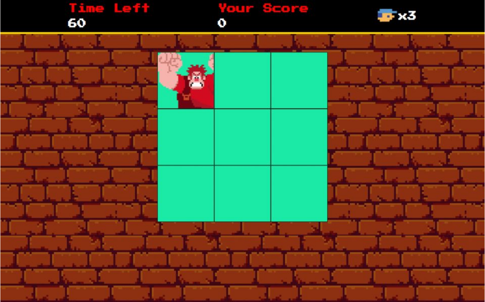

<h1 align="center"> Detona Ralph </h1>

Jogo do Detona Ralph

  <a href="#-tecnologias">Tecnologias</a>&nbsp;&nbsp;&nbsp;|&nbsp;&nbsp;&nbsp;
  <a href="#-projeto">Projeto</a>&nbsp;&nbsp;&nbsp;|&nbsp;&nbsp;&nbsp;
  <a href="#-deploy">Deploy</a>&nbsp;&nbsp;&nbsp;|&nbsp;&nbsp;&nbsp;

 

  

## 🚀 Tecnologias

Esse projeto foi desenvolvido com as seguintes tecnologias:

- HTML e CSS
- JavaScript
- Git e Github

## 💻 Projeto
Meu projeto é um jogo inspirado no Detona Ralph, onde o objetivo é acumular o máximo de pontos possíveis em três chances. No jogo, Ralph aparece em diferentes janelas, e o jogador precisa clicar rapidamente na janela correta para pontuar. A interface do jogo é vibrante, com gráficos retrô que remetem ao estilo pixel art característico do filme e de clássicos dos videogames.

O jogo conta com um sistema de pontuação exibido no topo da tela, ao lado de um contador de tempo, desafiando o jogador a ser ágil e preciso. As três chances representam as vidas disponíveis, aumentando o desafio e mantendo a tensão enquanto o tempo avança. É uma ótima forma de divertir e testar os reflexos de quem joga!

Esse projeto demonstra habilidades em desenvolvimento de jogos, design visual e lógica de programação, sendo ideal para atrair atenção de jogadores casuais e fãs do filme. 🚀

## 🔗 Deploy

Link do Projeto: https://detona-ralph-indol.vercel.app/

---

Feito por Guilherme Lins Oliveira.
